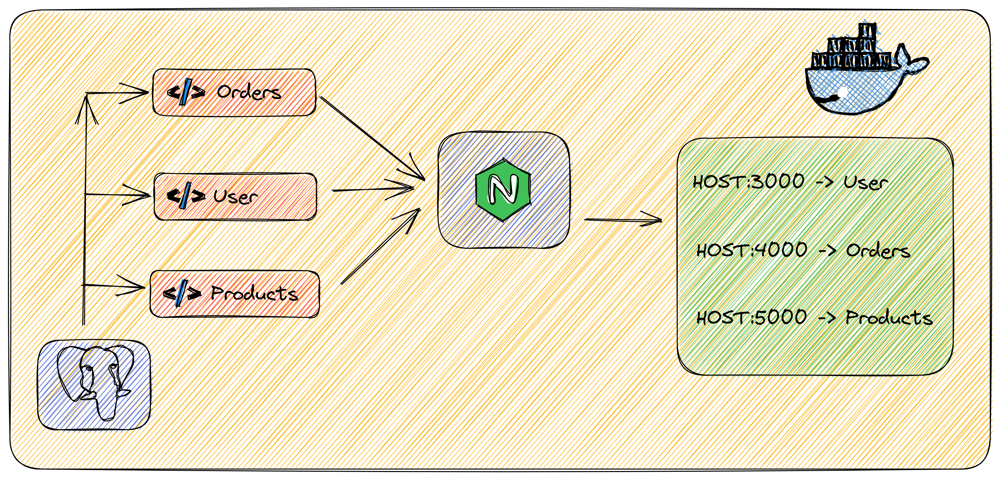

# Hoppscotch BE Assignment

## Problem Statement

Dockerize three microservices using docker-compose and route the traffic to the appropriate service using Reverse Proxy.

## Solution

### Architecture

### Steps to run

1. Clone the repository
2. Copy the `.env.example` file to `.env` and update the values
3. Use `manage.sh` to manage the services
    - `./manage.sh start all` to start all the services
    - `./manage.sh stop all` to stop all the services
    - `./manage.sh status all` to get the status of all the services
    - `./manage.sh restart all` to restart all the services
  > Note: The above commands `all` can be replaced with `orders`, `products` and `user` as well
